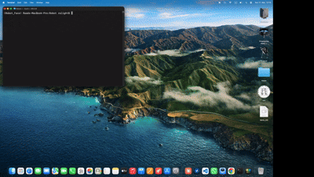
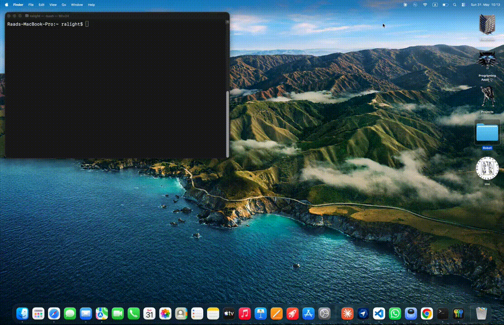

# Robot Face Animation

A pygame-based animated robot face built as part of a Bachelor's module in **Human-Centered Robotics** (*Menschenzentrierte Robotik*) at university. The face was designed to be the visual interface of a **KUKA one-arm robot**, receiving commands from a Java-based robot controller over a TCP connection and reacting with expressive animations.

The module focused on the socio-technical design of human-robot interaction — combining engineering and psychology to make robots more approachable and communicative. This face was our team's contribution: a real-time animated display that gives the robot a personality.

<div align="center">

### Face Display


*The animated robot face — eyes, mouth, blinking, and speaking animation. No audio in the gif — sound plays during live use.*

</div>

---

## What It Does

The robot face renders an animated sci-fi style face in a pygame window and responds to commands in real time:

- **Eye movement** — eyes move left, right, center, or to a precise position
- **Mouth animation** — physics-based mouth that animates when the robot speaks
- **Blinking** — automatic randomized blinking
- **Sound playback** — plays registered audio files on command
- **Mute button** — toggle sound on/off from the UI
- **TCP socket** — receives commands from a Java robot controller or any TCP connection over the network
- **CLI mode** — run and test without any robot hardware using `--no-socket`

---

## Getting Started

### 1. Clone the repository

```bash
git clone https://github.com/Ra-Light93/Robot-Face-Animation.git
cd Robot-Face-Animation
```

The repository includes everything needed to run — source code, audio files, and the Java TCP client. Once cloned you are ready to go.

### 2. Set up the conda environment

Install [Miniforge](https://github.com/conda-forge/miniforge) or any conda distribution, then initialize conda for your shell. You only need to do this once:

```bash
conda init bash
```

Close and reopen your terminal, then create and activate the environment:

```bash
conda env create -f environment.yml
conda activate Robot_Face
```

This installs Python 3.12 and pygame automatically.

> You can change the environment name by editing the `name` field at the top of `environment.yml` before running `conda env create`.

<div align="center">

### Startup & Initialization


*Starting the program, loading config, and registering audio files.*

</div>

### 3. Run the face

**CLI mode** (no robot needed):
```bash
python src/main.py -ns  # or --no-socket
```

**Socket mode** (waiting for Java robot):
```bash
python src/main.py
```

### Removing the environment

If you want to remove the environment:

```bash
conda deactivate
conda env remove --name Robot_Face
```

---

## Command Line Flags

| Flag | Short | Default | Description |
|------|-------|---------|-------------|
| `--no-socket` | `-ns` | off | Run without TCP connection (CLI/test mode) |
| `--port` | `-p` | `30001` | TCP port to listen on |
| `--width` | `-ww` | `1000` | Window width in pixels |
| `--height` | `-hh` | `1000` | Window height in pixels |

Examples:
```bash
python src/main.py -ns                    # CLI mode
python src/main.py -ns -ww 800 -hh 800   # smaller window
python src/main.py -p 30002              # custom port
```

---

## Commands

All robot commands follow a two-word prefix format: `<type> <value>`

### Eye Commands

```
eye left       — look left
eye right      — look right
eye center     — look center
eye <0-90>     — precise position (0 = far left, 45 = center, 90 = far right)
```

### Sound Commands

```
sound <name>   — play a registered sound by command name
```

Sound commands must be registered in `Audios/audio_register.json` before use (see below).

---

## Registering Sound Commands

Sound commands are mapped in `Audios/audio_register.json`. Each entry maps a **command name** to an **audio filename** (including extension):

```json
{
    "gs":      "gs.mp3",
    "on":      "On1.mp3",
    "off":     "Aus1.mp3",
    "ns":      "leermagazine.mp3",
    "buttonp": "buttonp.mp3"
}
```

Rules:
- The structure must be flat — no nested objects (e.g. `"gs": "gs.mp3"`, not `"gs": {"file": "gs.mp3"}`)
- The filename must include the extension (`.mp3`, `.wav`, etc.)
- The audio file must exist in the `Audios/` folder
- All entries are validated on startup — a clear error is raised if anything is missing

To add a new sound:
1. Drop your audio file into the `Audios/` folder
2. Add an entry to `audio_register.json`, e.g. `"say_hi": "hi_sound.mp3"`
3. Restart the program so the new sound is registered
4. Call it with `sound say_hi`

---

## Architecture

The project is split into four main parts:

### `config.py` — The Brain
Holds the global `DataVariables` singleton (`SimpleNamespace`) that stores every piece of shared state: colors, sizes, positions, animation state, socket connection, audio registry, and more. All other modules call `get_config()` to access it. **If you want to change how the face looks or behaves, start here.**

The design follows a shared-state pattern: any module can read or update `DataVariables` at any time without coordinating with other parts of the system. Changes take effect automatically on the next frame — the main loop runs at 60fps and calls all animation functions in sequence, each of which reads the current state and renders accordingly. This means a single variable update anywhere in the code is enough to change what the face does next.

### `Animation/` — The Face
All drawing and animation functions live here: the face border, eyes, mouth, blinking, speaking animation, and UI buttons. Every parameter is read from `DataVariables`, so the face scales automatically with window size and responds instantly to state changes.

### `communication.py` — The Ears
Handles all incoming input — whether from the terminal or over TCP. `handle_robot_command()` is the single entry point for all commands regardless of source, keeping the command logic in one place. `update_user()` routes feedback either back to the connected TCP client or to the local terminal depending on the current mode (socket or CLI).

### `main.py` — The Wiring
The entry point that ties everything together. It initializes pygame, parses command line arguments, sets up the config, opens the TCP socket if needed, starts the listener thread, and runs the main 60fps draw loop.

---

## TCP Connection (Java)

The face acts as a TCP **server** — it listens for a single client connection. A Java example client is included in `JavaTCPClient/`.

<div align="center">

### TCP Connection Demo


*Sending commands from the Java client to the robot face over TCP.*

</div>

### Compile and run the Java client

```bash
cd JavaTCPClient
javac RobotFaceClient.java
java RobotFaceClient           # default port 30001
java RobotFaceClient 30002     # custom port
```

Start the Python face first, wait for `Waiting for connection...`, then run the Java client.

The Java client reads commands from your terminal and sends them to the face. Any feedback from the face is printed back with `<- Python: ...`.

### Command format for Java

Same as CLI — just send the string over the socket:
```
eye left
sound gs
eye 45
```

---

## Project Structure

```
Robot-Face-Animation/
├── src/
│   ├── main.py              # Entry point
│   ├── config.py            # Global state and audio registry
│   ├── communication.py     # Input handling, sound, TCP
│   └── Animation/           # All drawing functions
├── Audios/
│   ├── audio_register.json  # Sound command mappings
│   └── *.mp3                # Audio files
├── JavaTCPClient/
│   └── RobotFaceClient.java # Example Java TCP client
├── media/
│   ├── demo_display.gif     # Face display demo
│   ├── demo_init.gif        # Initialization demo
│   └── demo_tcp.gif         # TCP connection demo
└── environment.yml          # Conda environment
```

---

## Background

This project was built as part of the **Menschenzentrierte Robotik** module — an interdisciplinary course where students from engineering and psychology work together on human-robot interaction challenges. The goal was to design a socio-technical system where a robot can communicate naturally with humans.

My part in this project was developing the robot's face — the visual interface that gives the robot a personality. The goal was to make an impression on people interacting with the robot by giving it a face that feels alive and responsive: one that blinks, moves its eyes, and speaks through synchronized mouth animation and audio playback.

The robot successfully completed the module.

---

## License

